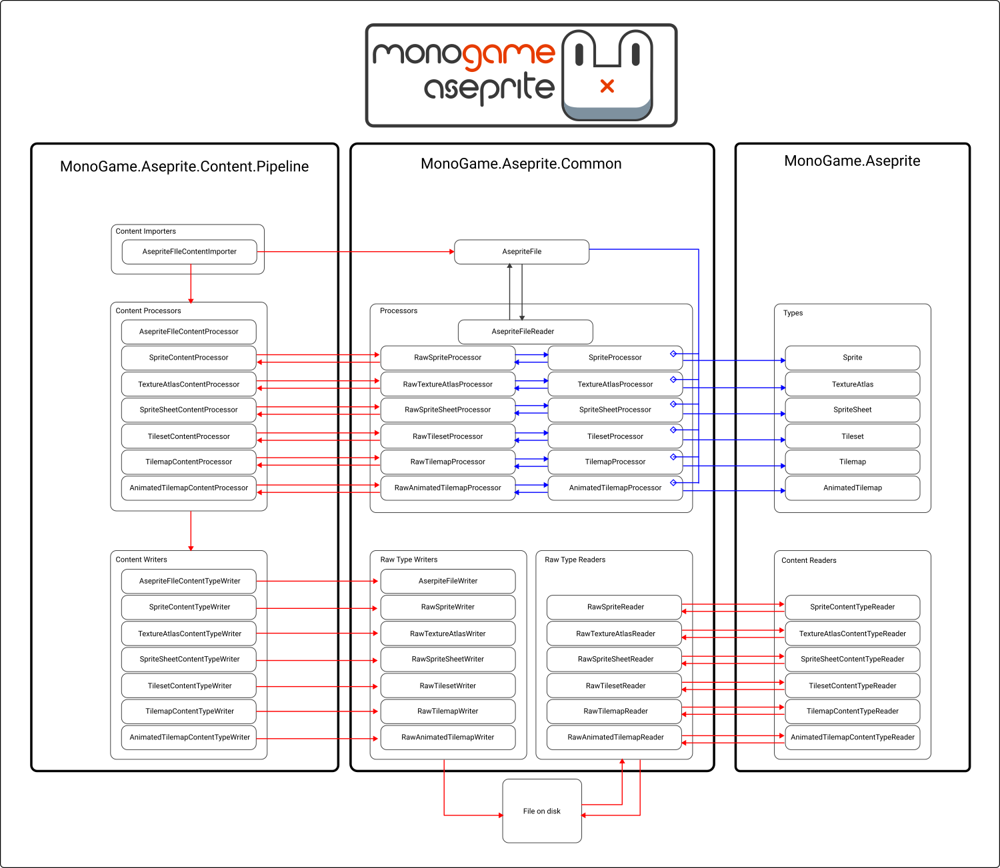

import useBaseUrl from "@docusaurus/useBaseUrl";
import WorkflowDiagram from './import-process-write-read-workflow.png';

Hi everyone,

I'm working hard to finalize the version 4.0 update for MonoGame.Aseprite. While I'm doing this, I wanted take a moment to talk about one of the new features in the update; the **processors**. That's right, multiples!

Before now, there was only one processor. When you used the MGCB Editor to import your Aseprite file, the processor would translate the imported data into a sort of aseprite file + spritesheet hybrid called the `AsepriteDocument`. This was bad for a few reasons:

1. The MGCB Editor was required
   - What if you have a custom content management solution? Using FNA?
2. The `AsepriteDocument` represented two things instead of one concrete idea.
   - Is it my file contents or is it a spritesheet?
3. The aseprite file imported was forced to meet requirements like having tags.
   - What if you have a single frame image that you just want as a static background? Can't import it without an animation tag.

To solve these problems, a new way of importing and processing the data needed to be implemented. I've received feedback for a while now asking to decouple the MGCB Editor requirement. I was hesitant because the current implementation was pretty rigid and would require a large rewrite, and as a solo developer with a full time job and family, I didn't have a lot of time. I also received questions quite frequently where users would hit errors when importing because they didn't have least one tag defined in Aseprite, so this really needed to be fixed for single frame static images.

Aseprite is also now in version 1.3-beta21, which includes Tileset and Tilemaps. Though it's still in development, and missing a few planned features [(like tile xflip/yflip/rotation)](https://github.com/aseprite/aseprite/issues/3603), I wanted to be able to lay out the framework for supporting this early now instead of scrambling later.

So how did I solve these problems?

<!--truncate-->

## Separation of Concerns

The first step was to take a good hard look at the `AsepriteDocument` class. It was the bases of everything. Importing, processing, everything, started there. It was a monopoly that needed to be split. So that's exactly what I did.

The `AsepriteDocument` has now become the `AsepriteFile`. It now represents the raw data that is imported during the import step. It contains all of the layer, frame, cel, tag, slice, tileset, and tilemap data from your Aseprite file. Not only does it contain this data, but you get a **per-layer representation of the individual cels in a frame**. This means, if you wanted to, you could generate your own `Texture2D` instances on a per-cel basis. That's for another blog post another day.

So, now that was have this concrete implementation in the `AsepriteFile`, the generation of the `Texture2D` that represented the packed spritesheet needed to be put somewhere. From this, the `TextureAtlas` class was born. The `TextureAtlas` is a class that wraps a `Texture2D` and holds a collection of named regions that represent the source rectangles for the individual frames in the packed image.

So now, from the poorly implemented hybrid class that was the `AsepriteDocument`, we have separated concerns and have two concrete implementations, the `AsepriteFile` and the `TextureAtlas`.

**However, we have now introduced a new problem.** How do we translate the raw data in the `AsepriteFile` into a packed image of all the frames to create the `TextureAtlas`?

## And Thus, the First Processor Was Born

Some task needed to sit in the middle, between the `AsepriteFile` and the `TextureAtlas` that could translate. The idea is easy enough, take an `AsepriteFile`, flatten each frame, and inject the pixel data from the frame into an array of pixel data that represented the packed image. This was sort-of already solved in the current implementation, I mean, that's what we were already doing for the original `AsepriteDocument`. So I gutted out the portion of the code there and used it to create the `TextureAtlasProcessor`.

It's simple enough, import the contents of an Aseprite file as an `AsepriteFile` class instance, then call on the `TextureAtlasProcessor` class to take that `AsepriteFile`, process it, and return back the `TextureAtlas`. Something still isn't right though. Something else needs to be changed here.

What is it....
...
Oh right, we're still coupled to the MGCB Editor. This is all happening within the MGCB Editor. So this looked like a good time to start solving that problem.

## To MGCB Editor or Not To MGCB Editor, That Is The Question

I went back and forth on this a lot. On one hand, it would be a lot of work to decouple this requirement. On the other hand, I received enough feedback/requests to merit doing the work to decouple this. On the other hand, though, it's still a lot of work that needs to be done. In the end though, I did the work, and oh boy am I glad that I did.

I didn't realize it until much later, but for the `MonoGame.Aseprite` library, the MGCB Editor isn't really needed at all....like _at all_. I mean, sure, doing the importing and processing steps there to produce the .xnb file definitely saves some time upfront, but let's be realistic. I have a test file Aseprite file that I use when developing. It has ~170 frames, about 20 layers, multiple tags, and many many pixels. It's sits at a whooping 102 KB. I doubt many Aseprite files are going to very large, it's not like we're going to be reading and processing multi-MB files. We're talking about KB here. Even still, at runtime when you call `Content.Load<T>(string)` guess what happens? It reads the contents of an .xnb file, and processes the data.

So requiring the MGCB Editor was basically requiring users to read and process data twice, once during build, and once during runtime.

This isn't a knock on the MGCB Editor, and honestly, I still use it. It has it's benefits for sure, but it's not a requirement when developing with MonoGame. It's just a provided tool. So, in the end, I decided that it was best to decouple from the MGCB Editor.

## Raw Processing and Writing

One of the problems that now exists to decouple the MGCB Editor, is that I need some way of using the processor to process the data into a concrete implementation, but without a full game being run. See, the `TextureAtlas` wraps a `Texture2D` instance. This means a `Texture2D` needs to be created, which requires an instance of the `GraphicsDevice`. Without a full game being run, how do I do this? No `GraphicsDevice` is initialized to create the `Texture2D` with.

So how do I process the `AsepriteFile` to create the `TextureAtlas` without a game being run?

A `Texture2D` only needs 4 things to be created at runtime

1. A `GraphicsDevice` instance.
2. A width value.
3. A height value.
4. The pixel data as a `Color[]`.

The `GraphicsDevice` is just a creation detail, it doesn't _define_ the `Texture2D`, however the width, height, and pixel data do. These are the **raw** representations of the texture. So that's the idea I went with and created some supporting classes; the `RawTextureAtlas`, `RawTexture`, and `RawTextureRegion` classes.

These classes are just data transfer objects (DTOs), they represent the basic raw values needed to create the concrete implementations. To further decouple from the MGCB Editor, a writer and a reader was implemented to write the contents of the raw classes to a file and read them back in at runtime. So the full steps of processing the content became this

1. Import the contents of the Aseprite file as an `AsepriteFile` instance.
2. Use the processor to create the `RawTextureAtlas` instance.
3. Use the raw type writer to write the `RawTextureAtlas` to a file.
4. Use the raw type reader to read the `RawTextureAtlas` from a file.
5. Create the `TextureAtlas` from the `RawTextureAtlas`

## Isn't This the Same Thing With Extra Steps?

Well, yes. While this decouples the need for using the MGCB Editor, it still requires the content to be pre-processed using some content/asset pipeline at build, then re-imported and processed at runtime. So this solves half of the problem with decoupling the MGCB Editor. With these new steps in place, the MGCB Editor can use them to do the pre-processing for users that want to use the MGCB Editor, and other users can hook into this process for their own content/asset pipeline solution.

So, now we needed to solve the other half of the problem. What if users just want to load the Aseprite file at runtime, throw it at a processor and get the result without dealing with the raw type conversions between. That was solved easily enough, we just need two processors; one for the concrete implementation, and one for the raw implementation. So users pick which best suites their workflow and design choices for the game, engine, and content/asset pipeline.

I never said it wasn't going to sound complicated, but in practice it's not as complicated as it sounds.

## So Where To Go From Here

At this point, I had a solid design and workflow in place

1. Pre-processing can be done using the raw type processor and the raw type DTOs
2. Runtime processing can be done using the concrete processor

This gives me a more adaptable design. I'm creating a `TextureAtlas` with it all from the `AsepriteFile`, but what about the other things? A single frame `Sprit`, an full `SpriteSheet` with the animation data, an `AnimatedSprite`, `Tileset` and `Tilemap`. These were all easy enough to implement using the design pattern that was set forth, Create a concrete processor for each and a raw type processor for each.

## Meet the Processors

That leads us here to this final section. In all, the new `MonoGame.Aseprite` version 4.0 update will include a total of 1 importer and 6 processors

| Importer            | Summary                                                                                                                                                                     |
| ------------------- | --------------------------------------------------------------------------------------------------------------------------------------------------------------------------- |
| `AsepriteFile.Load` | This is more a method than a full importer, but this static method imports the contents of the Aseprite file from disk and returns back the `AsepriteFile` instance created |

| Processor                  | Summary                                                                                                                                                                                                                                                          |
| -------------------------- | ---------------------------------------------------------------------------------------------------------------------------------------------------------------------------------------------------------------------------------------------------------------- |
| `SpriteProcessor`          | Used to process a any single frame in the `AsepriteFile` as a `Sprite`                                                                                                                                                                                           |
| `TextureAtlasProcessor`    | Used to process all frames in an `AsepriteFile` as a `TextureAtlas` with a source image representing all frames packed into a single image and named `TextureRegion` elements representing the source rectangle bounds for each region                           |
| `SpriteSheetProcessor`     | Used to process all frames, tags, and slices in an `AsepriteFile` as a `SpriteSheet`. A `SpriteSheet` wraps a `TextureAtlas` internally for the source image and region data and provides methods for creating `AnimatedSprite` instances based on the tag data. |
| `TilesetProcessor`         | Used to process any single tileset in the `AsepriteFile` as a `Tileset`. `Tileset` is similar to a `TextureAtlas` in that it contains a source image of the packed tiles with named `TextureRegion` elements for each tile.                                      |
| `TilemapProcessor`         | Used to process tilemap layers on any single frame in the `AsepriteFile` as a `Tilemap`. A `Tilemap` retains the per-layer representation and uses `Tile` elements along with a `Tileset`.                                                                       |
| `AnimatedTilemapProcessor` | Used to process tilemap layers on every frame in the `AsepriteFile` as an `AnimatedTilemap`. An `AnimatedTilemap` is similar to a regular `Tilemap` only it contains frames and can be animated like an `AnimatedSprite`.                                        |

Each of these processors has a corresponding raw type processor, raw type DTOs, and raw type writers to assist users that want to do pre-processing at build time rather than at runtime, both with the MGCB Editor or with their own custom content/asset processing workflow.

For anyone that likes diagrams, here is how it all works (sorta, I'm sure I probably left something out).

I think this is where I'll wrap this up. Thanks for checking it out and hope you're looking forward to the version 4.0 release really soon!

- Chris (Aristurtle)