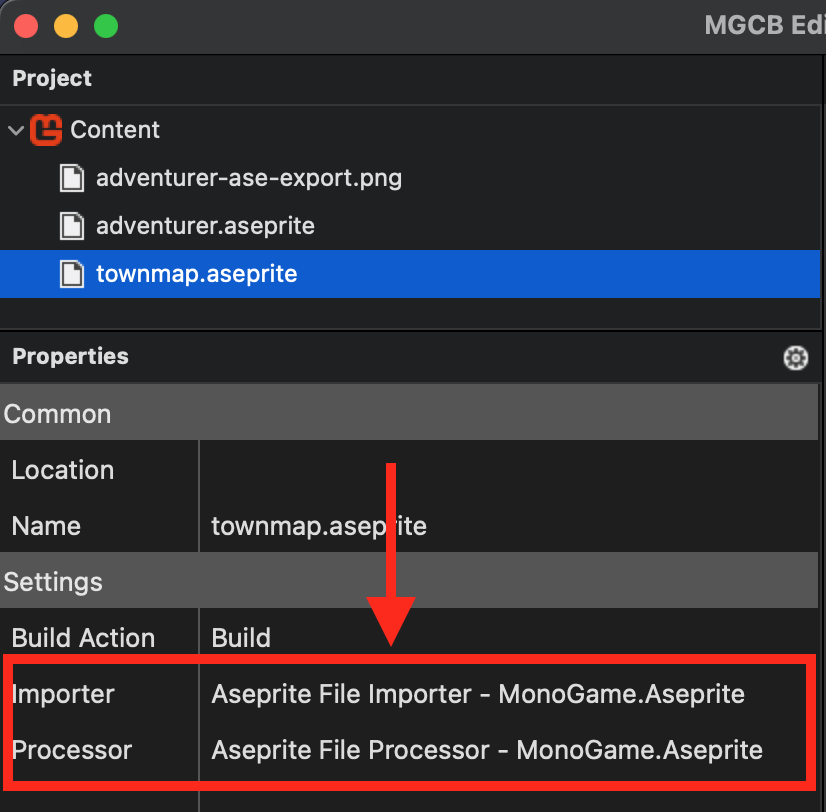

The purpose of this document is to provide an overview of how to load your Aseprite file so it can be used in your game at runtime.

# Overview

The [AsepriteFile](../api/MonoGame.Aseprite/AsepriteFile/AsepriteFile.md) class is the starting point for everything that can be done using this library. When the contents of your Aseprite file are imported, they are presented through the properties of the [AsepriteFile](../api/MonoGame.Aseprite/AsepriteFile/AsepriteFile.md) instance that is created. This includes each layer, frame, cel, tag, and slice. If you are using Aseprite 1.3-beta, the tilesets and tilemaps are also imported.

The data presented in the [AsepriteFile](../api/MonoGame.Aseprite/AsepriteFile/AsepriteFile.md) class is similar to how it is presented in the Aseprite application. For instance, each [AsepriteFrame](../api/MonoGame.Aseprite/AsepriteTypes/AsepriteFrame/AsepriteFrame.md)  element represents the frames in Aseprite and they contain a collection of [AsepriteCel](../api/MonoGame.Aseprite/AsepriteTypes/AsepriteCel/AsepriteCel.md)  elements that correspond to the cels. Each [AsepriteCel](../api/MonoGame.Aseprite/AsepriteTypes/AsepriteCel/AsepriteCel.md)  contains the individual pixel data for the cel it represents. This means you can get the individual cel pixel data per layer, per frame, if you wanted to go that granular. However, that is an advanced topic which is out of scope for this document. If you're interested in getting into the weeds with this, I recommend checking out that advanced guides section.

## Loading the Aseprite File

There are two ways of loading your Aseprite file to be used in your game project; at runtime or with the MGCB Editor. The sections below will provide examples of how to do both depending on your workflow.

### Loading at Runtime

To load the Aseprite file at runtime, you can use the [AsepriteFile.Load](../../api/MonoGame.Aseprite/AsepriteFile/Methods/Load.md) method. The following demonstrates how to do this.

**Add Using Statements**

```cs
using Monogame.Aseprite;
using MonoGame.Aseprite.Tilemaps;
using Monogame.Aseprite.Processors;
```

**Load the Aseprite File Using `AsepriteFile.Load`**

```cs
protected override void LoadContent()
{
    //  Load the Aseprite file
    AsepriteFile aseFile = AsepriteFile.Load("path-to-aseprite-file");
}
```

### Using the MGCB Editor
If you are using the MGCB Editor, first ensure that you have completed the prerequisite steps in the [Setup MGCB Editor](./setup-mgcb-editor) document.

Next, open your **Content.mgcb** file in the MGCB Editor and and add your Aseprite file as a content item.  Ensure that the **Aseprite File Importer** and **Aseprite File Processor** are selected as the Importer and Processor types for the file.



Then, in your game project, load the Aseprite file using the content manager. The following demonstrates how to do this:

**Add Using Statement**
```cs
using MonoGame.Aseprite;
```

**Load [AsepriteFile](../api/MonoGame.Aseprite/AsepriteFile/AsepriteFile.md) Using the `ContentManager`**
```cs
protected override void LoadContent()
{
    //  Load the Aseprite file using the ContentManager
    AsepriteFile aseFile = Content.Load<AsepriteFile>("content-name");
}
```

:::tip

Loading the Aseprite file from disk is like loading any asset in your game, whether it is done using the MGCB Editor or not.  It should be done where you load your game assets. For instance, within the `LoadContent` method of your `Game` class like shown in the example above.

:::

## Next Steps
Now that you can load the Aseprite file in your game project, next head to the [Processors Overview](../../processors/processors-overview) to learn about how to process the contents of the file.
